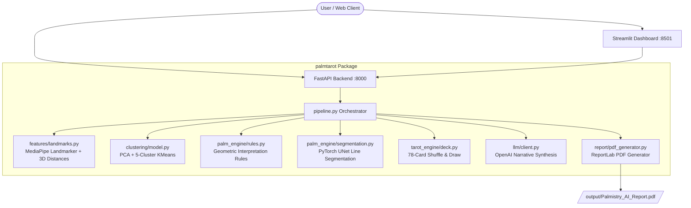

# AI Palmistry & Tarot Intelligence Platform 🔮✋

[](https://github.com/your-username/Palmistry-Tarot-Intelligence-Platform/actions/workflows/ci.yml)
[](https://fastapi.tiangolo.com)
[](https://streamlit.io)
[](https://pytorch.org)
[](https://www.python.org/downloads/)

Production-grade, deployable application for Milestone 4 of the Capstone Project. This platform combines MediaPipe hand landmarker feature extraction, scikit-learn PCA/KMeans clustering, PyTorch UNet palm line segmentation, geometric rule interpretation, Tarot deck drawing, OpenAI narrative synthesis, and ReportLab PDF compilation into an API and Streamlit executive dashboard.

---

## 🏗️ Architecture Overview



---

## 🛠️ Local Development Setup

### Prerequisites
- Python 3.10 or higher
- Git

### Installation

1. **Clone repository & enter directory:**
   ```bash
   git clone https://github.com/your-username/Palmistry-Tarot-Intelligence-Platform.git
   cd "Palmistry Tarot Intelligence Platform"
   ```

2. **Create virtual environment & activate:**
   ```bash
   python -m venv venv
   source venv/bin/activate        # Linux/macOS
   venv\Scripts\activate           # Windows
   ```

3. **Install dependencies:**
   ```bash
   pip install -r requirements.txt
   ```

4. **Environment Variables Configuration:**
   Copy `.env.example` to `.env` and populate your OpenAI API key:
   ```bash
   cp .env.example .env
   ```
   *Edit `.env` and set `OPENAI_API_KEY=your_actual_key`.*

---

## 🚀 Running the Application

### Option A: Local Execution (Python Module - Works on Windows / Linux / macOS)

1. **Start FastAPI Backend:**
   ```bash
   python -m uvicorn app.main:app --reload --port 8000
   ```
   *API Swagger documentation will be available at `http://localhost:8000/docs`.*

2. **Start Streamlit Dashboard (in a second terminal):**
   ```bash
   python -m streamlit run dashboard/app.py --server.port 8501 --server.headless true
   ```
   *Dashboard will open at `http://localhost:8501`.*

---

### Option B: Running with Docker Compose

Launch both the backend API and Streamlit dashboard simultaneously in isolated multi-stage containers:

```bash
docker compose up --build
# or legacy docker-compose up --build
```

- **Streamlit Dashboard:** `http://localhost:8501`
- **FastAPI Backend:** `http://localhost:8000`
- **Interactive API Docs:** `http://localhost:8000/docs`

---

## 🧪 Running Tests & Validation

Run the complete unit and integration test suite:

```bash
python -m pytest
```

Generate HTML coverage report:
```bash
pytest --cov=palmtarot --cov=app --cov-report=html
```

---

## 📡 REST API Reference

| Endpoint | Method | Input | Description |
| :--- | :--- | :--- | :--- |
| `/health` | `GET` | None | Liveness and readiness health check |
| `/analyze/palm` | `POST` | `file` (Image) | Returns 21 landmarks, 8 engineered features, cluster assignment, and rule report |
| `/analyze/tarot` | `POST` | JSON (`num_cards`) | Draws N tarot cards with orientation, light/shadow meanings, and positions |
| `/reading/full` | `POST` | `file` + Form data | Executes integrated pipeline (Palm + Tarot + LLM + PDF URL) |
| `/pdf/{filename}`| `GET` | Path | Downloads generated PDF reading report |

---

## ☁️ Cloud Deployment Instructions

### Deploying to Google Cloud Run (Recommended Container Target)

1. **Set Cloud Project & Authenticate:**
   ```bash
   gcloud config set project YOUR_GCP_PROJECT_ID
   gcloud auth configure-docker
   ```

2. **Build & Submit API Container to Artifact Registry:**
   ```bash
   gcloud builds submit --tag gcr.io/YOUR_GCP_PROJECT_ID/palmtarot-api:latest -f Dockerfile.api .
   ```

3. **Deploy FastAPI Backend to Cloud Run:**
   ```bash
   gcloud run deploy palmtarot-api \
     --image gcr.io/YOUR_GCP_PROJECT_ID/palmtarot-api:latest \
     --platform managed \
     --region us-central1 \
     --allow-unauthenticated \
     --set-env-vars OPENAI_API_KEY=your_openai_api_key_here
   ```

4. **Deploy Streamlit Dashboard to Cloud Run:**
   ```bash
   gcloud builds submit --tag gcr.io/YOUR_GCP_PROJECT_ID/palmtarot-dashboard:latest -f Dockerfile.dashboard .

   gcloud run deploy palmtarot-dashboard \
     --image gcr.io/YOUR_GCP_PROJECT_ID/palmtarot-dashboard:latest \
     --platform managed \
     --region us-central1 \
     --allow-unauthenticated \
     --port 8501
   ```

---

### Alternative Simpler Target: Render / Railway Deployment

1. **Railway Deployment:**
   - Install Railway CLI: `npm i -g @railway/cli`
   - Login: `railway login`
   - Deploy: `railway up`
   - Set environment variables: `railway variables set OPENAI_API_KEY=your_key`

---

## ⚠️ Known Limitations & Future Work

1. **MediaPipe Hand Detection**: Performance depends on hand orientation, lighting, and background contrast. Extreme angles might trigger standard fallback hand geometry.
2. **UNet Model Weights**: Runs CPU inference in default container deployment; GPU acceleration recommended for batch high-throughput enterprise processing.
3. **LLM API Rate Limits**: OpenAI API calls are rate-limited; fallback narrative handles offline or API quota exhaustion scenarios gracefully.
